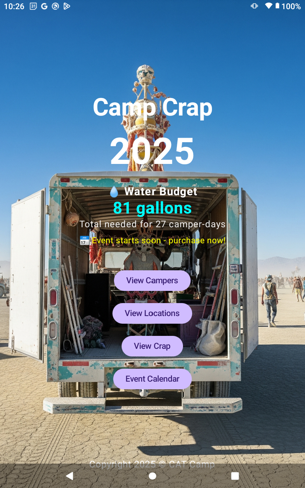
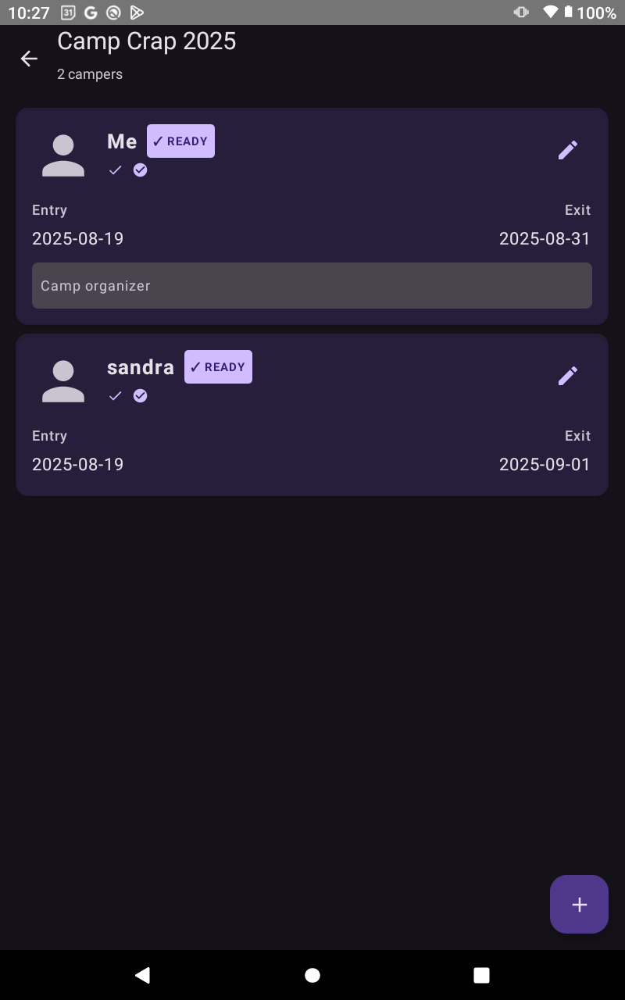
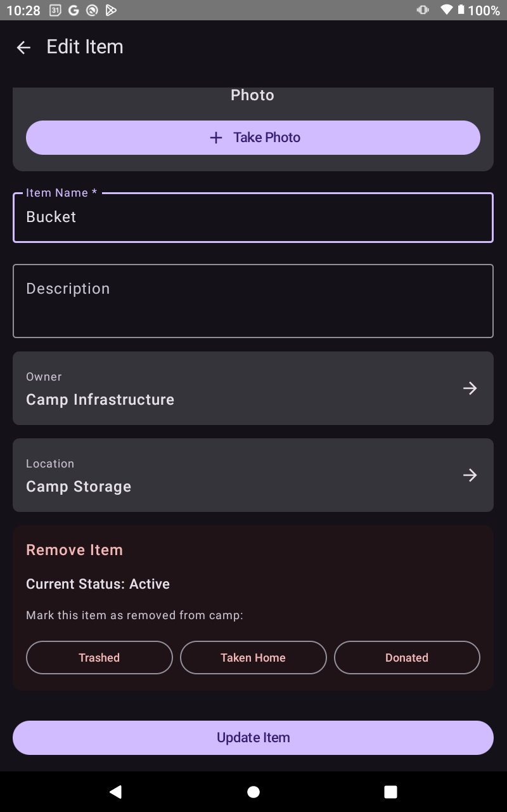
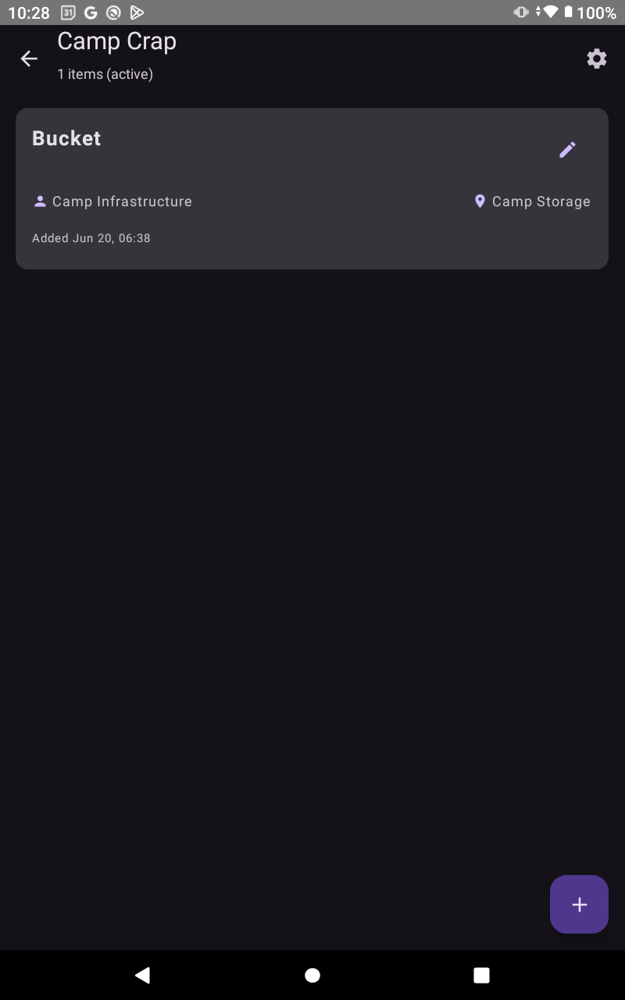
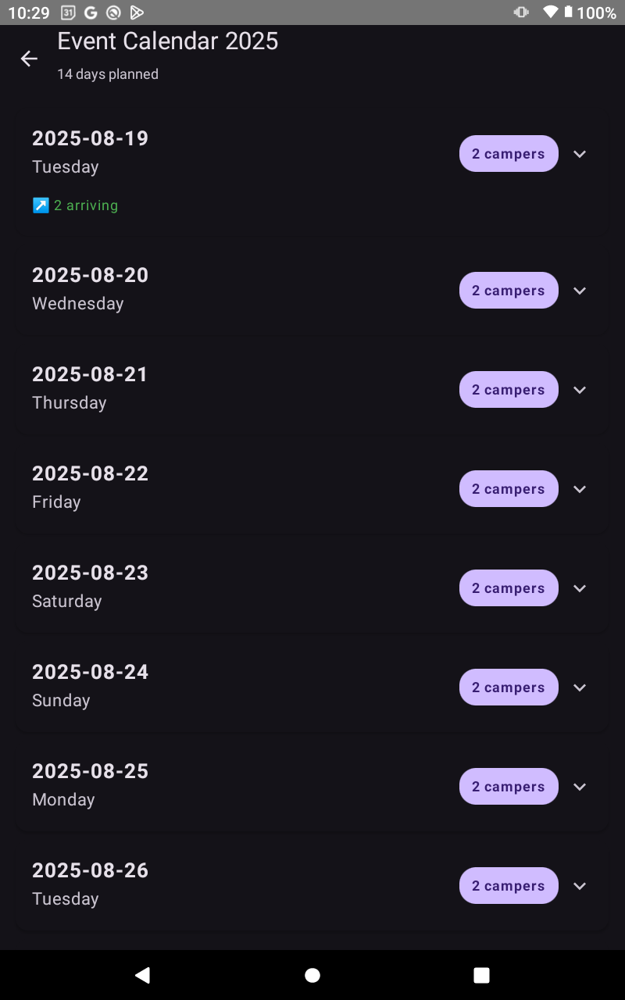

# CampCrap 2025

<p align="center">
  
</p>

CampCrap is a comprehensive camping inventory management system for CAT Camp, built with Kotlin and Jetpack Compose. The app helps organizers track campers, inventory items, locations, and water needs for camping events.

## Features

### 🏕️ Camper Management
- Track camper attendance with entry/exit dates
- Photo capture and display for each camper
- Status tracking: ticket purchases and dues payment for current year
- Visual indicators for compliance (✓ READY badge)
- Years attended tracking

### 📦 Inventory Management
- Add and manage camp equipment and supplies
- Photo capture for items
- Owner and location tracking
- Item removal tracking (trashed, taken home, donated)
- Hide/show removed items toggle

### 📍 Location Management
- Manage camp locations and storage areas
- Location descriptions and organization
- Automatic "Camp Storage" location creation

### 💧 Water Management
- Automatic water calculation (3 gallons per person per day)
- Pre-event budget planning
- During-event current needs tracking
- Real-time updates based on camper entry/exit dates

### 📅 Event Calendar
- Visual calendar showing daily attendance
- Expandable daily details with arrivals/departures
- Event duration tracking (14 days planned)

### 📊 Data Import/Export
- Excel (.xlsx) export with multiple tabs
- Year-to-year data migration
- Portable data format for sharing and backup
- Import baseline data for new years

## Screenshots

### Main Dashboard


The main dashboard shows water budget information and provides quick access to all major features.

### Camper Management


Track all campers with photos, status indicators, and compliance badges. Green highlighting shows fully compliant campers.

### Item Management


Comprehensive item editing with photo capture, owner tracking, and removal status options.

### Inventory View


Clean inventory list showing items with owner and location information.

### Event Calendar


Day-by-day attendance tracking with expandable details for arrivals and departures.

## Technical Details

### Architecture
- **Platform**: Android (minSDK 26, targetSDK 35)
- **Language**: Kotlin 2.0.21
- **UI Framework**: Jetpack Compose with Material 3
- **Database**: SQLite with custom DatabaseHelper
- **Camera**: Android Camera API with FileProvider
- **File Handling**: Android Storage Access Framework
- **Excel Processing**: Apache POI library

### Key Components
- **MainActivity.kt**: Main dashboard with water calculations and navigation
- **DatabaseHelper.kt**: SQLite database management (version 7)
- **ExcelService.kt**: Import/export functionality
- **EventCalendarActivity.kt**: Calendar view with attendance tracking
- **CamperListActivity.kt**: Camper management with photos and status
- **ItemListActivity.kt**: Inventory management with removal tracking
- **LocationListActivity.kt**: Location management system

### Database Schema
- **People table**: Camper information with photos and status tracking
- **Items table**: Inventory with removal status and photos
- **Locations table**: Camp locations and storage areas
- **Year-based organization**: All data tied to specific camp years

## Build Instructions

### Prerequisites
- Android Studio
- Android SDK (API 26+)
- Kotlin 2.0.21+

### Building
```bash
# Clone the repository
git clone <repository-url>
cd CampCrap

# Build the project
./gradlew build

# Install debug APK
./gradlew installDebug

# Run tests
./gradlew test

# Run instrumented tests
./gradlew connectedAndroidTest

# Clean build
./gradlew clean
```


## Water Calculation Logic

The app automatically calculates water needs based on:
- **3 gallons per person per day** standard
- Entry and exit dates for each camper
- Current date context:
  - **Pre-event**: Shows total budget for purchasing
  - **During event**: Shows current needs for remaining days
  - **Post-event**: Shows final consumption summary

## License

```
Copyright 2025 CAT Camp

Licensed under the Apache License, Version 2.0 (the "License");
you may not use this file except in compliance with the License.
You may obtain a copy of the License at

    http://www.apache.org/licenses/LICENSE-2.0

Unless required by applicable law or agreed to in writing, software
distributed under the License is distributed on an "AS IS" BASIS,
WITHOUT WARRANTIES OR CONDITIONS OF ANY KIND, either express or implied.
See the License for the specific language governing permissions and
limitations under the License.
```

## Contributing

This project is maintained by CAT Camp organizers. For bug reports or feature requests, please contact the development team.

---

Built with ❤️ for CAT Camp 2025
